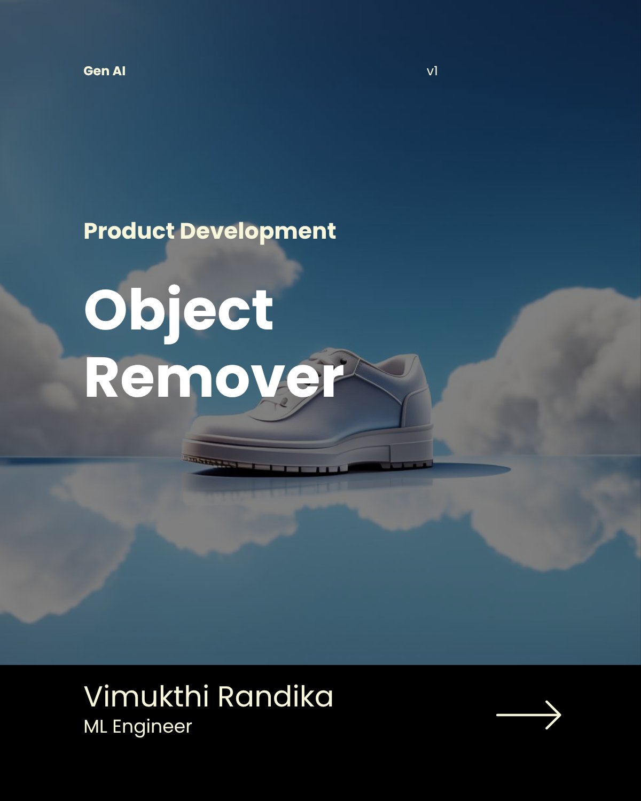
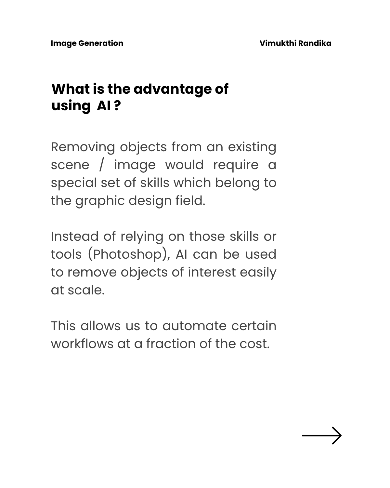
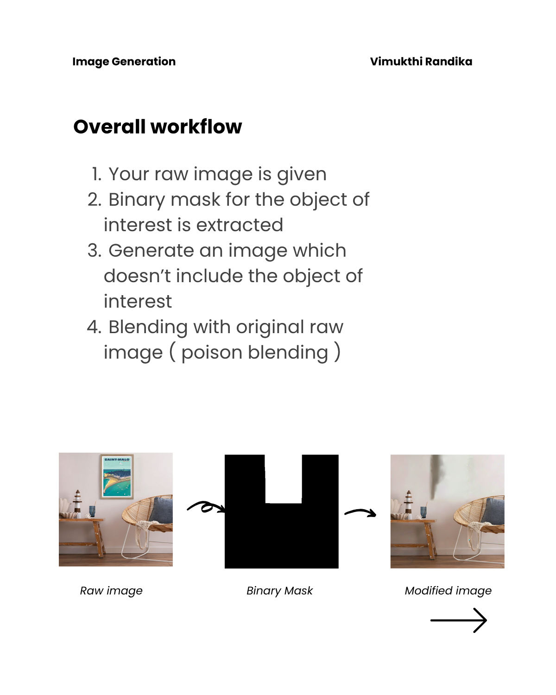
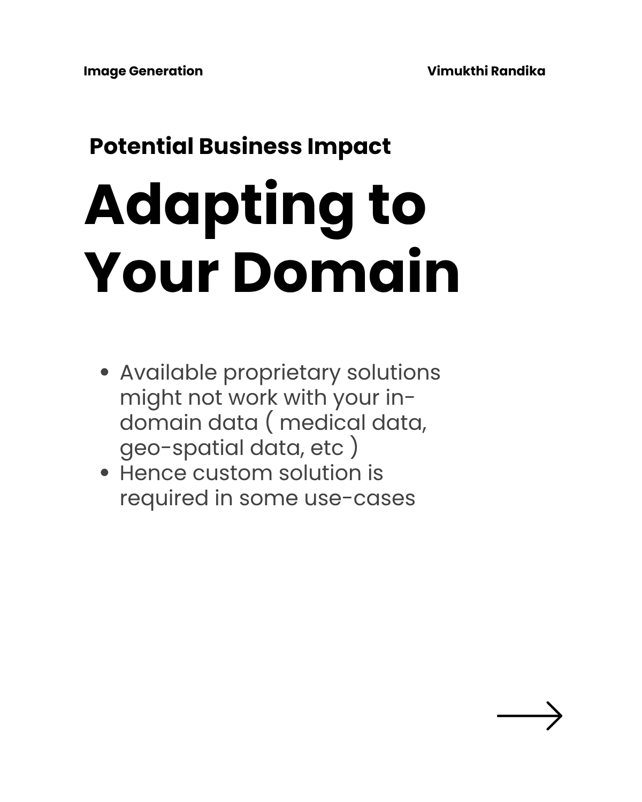
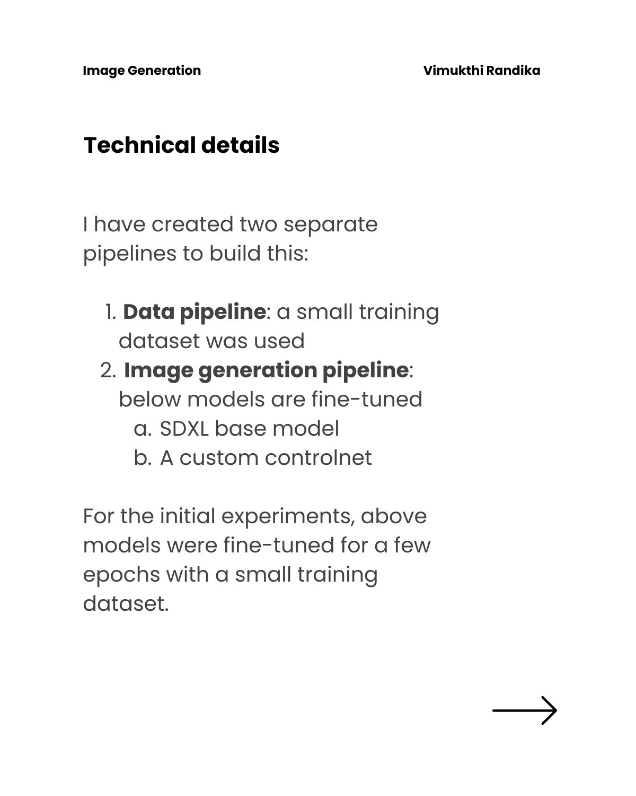
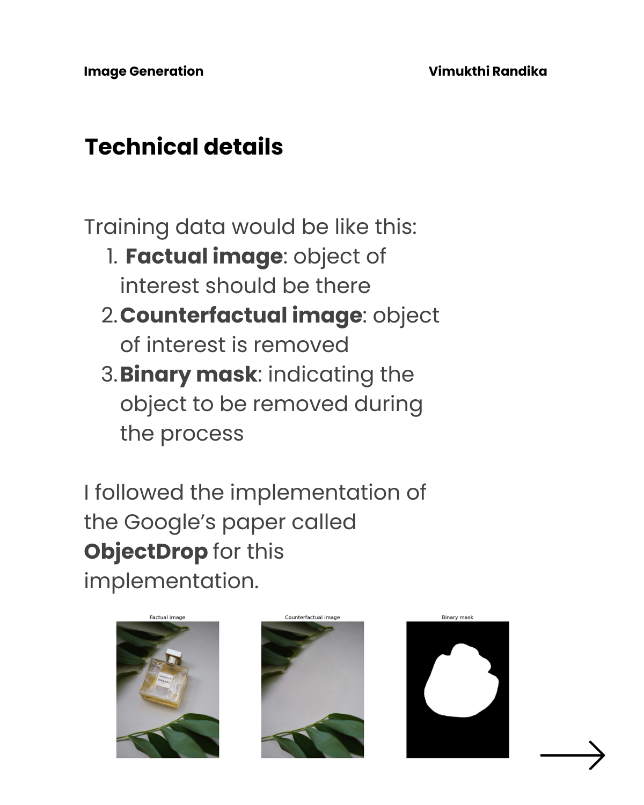
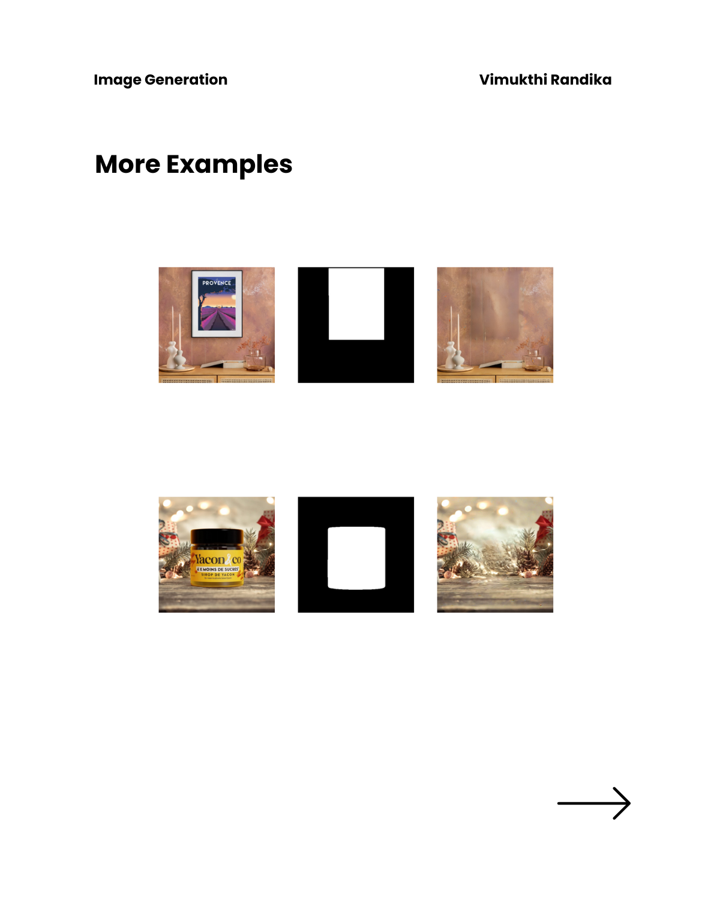
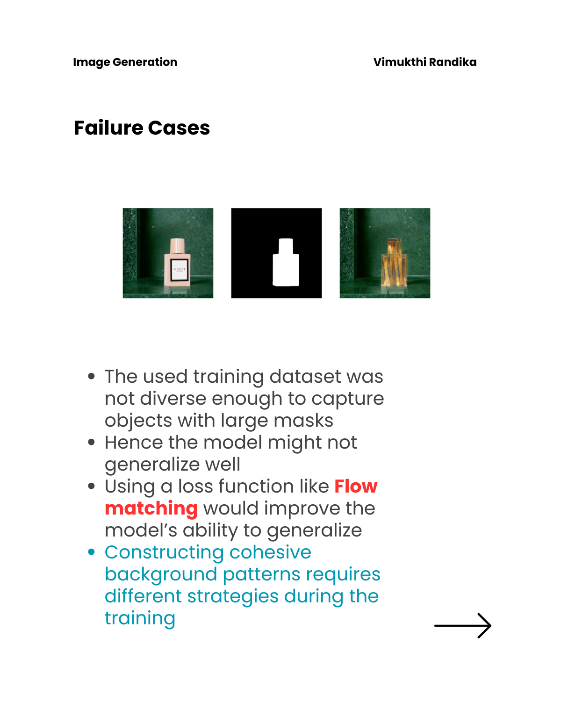

# Removing Objects using AI

Remove certain objects by specifying the area to be removed with a binary mask. This can used for in-domain functionalities where data privacy is a concern.

The research paper called **ObjectDrop** from Google is implemented with SDXL controlnet models.




## For training on a custom dataset

```bash
# Set the configurations in trian.sh script
cd src/
bash train.sh > logs.txt

```

## Business Value

<div style="display: flex; gap: 10px;">
  
</div>


## Workflow

<div style="display: flex; gap: 10px;">
  
</div>

## Features

<div style="display: flex; gap: 10px;">
  
  
</div>

## Technical Details

<div style="display: flex; gap: 10px;">
  
  
</div>

## Examples

<div style="display: flex; gap: 10px;">
  
  
</div>